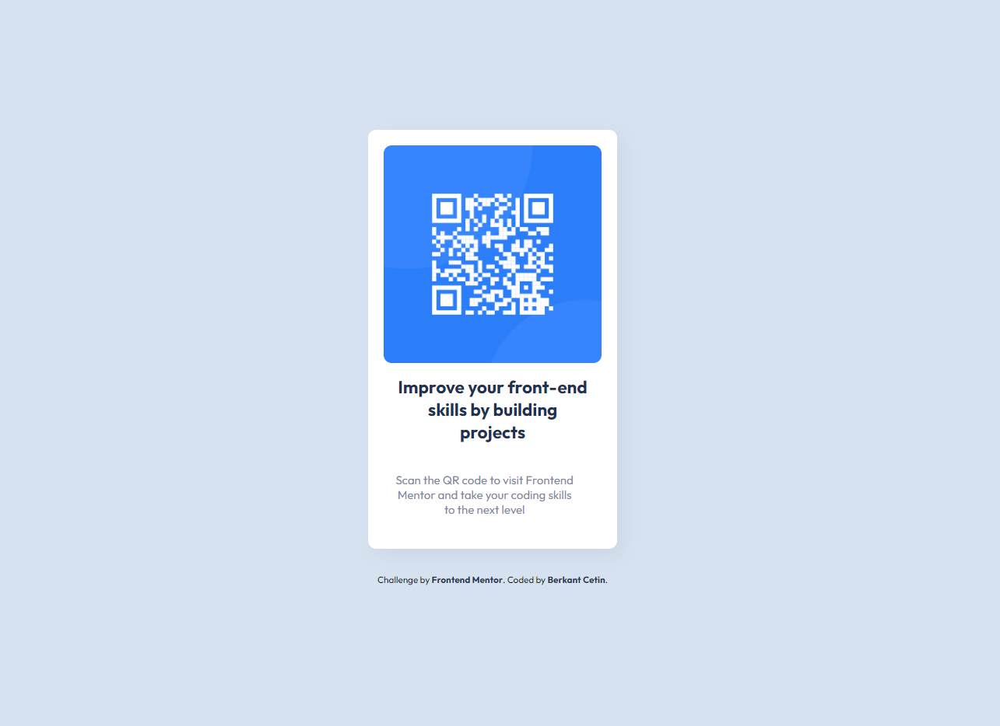

# Frontend Mentor - QR code component solution

Dies ist eine Lösung für die ["QR-Code-Component" auf Frontend Mentor](https://www.frontendmentor.io/challenges/qr-code-component-iux_sIO_H). 

## Inhaltsübersicht

- [Übersicht](#Übersicht)
  - [Screenshot](#screenshot)
  - [Links](#links)
  - [Gebaut mit](#gebaut-mit)
  - [Author](#author)

## Übersicht

### Screenshot

### Links

- Solution URL: [Add solution URL here](https://your-solution-url.com)
- Live Site URL: [Add live site URL here](https://your-live-site-url.com)

### Gebaut mit

- Semantisches HTML5 Markup
- Benutzerdefinierte CSS-Eigenschaften
- Flexbox
<!-- - Mobile-first workflow -->
<!-- - [React](https://reactjs.org/) - JS library -->
<!-- - [Next.js](https://nextjs.org/) - React framework -->
<!-- - [Styled Components](https://styled-components.com/) - For styles -->

## Author

- Frontend Mentor - [@Beggsn](https://www.frontendmentor.io/profile/Beggsn)

